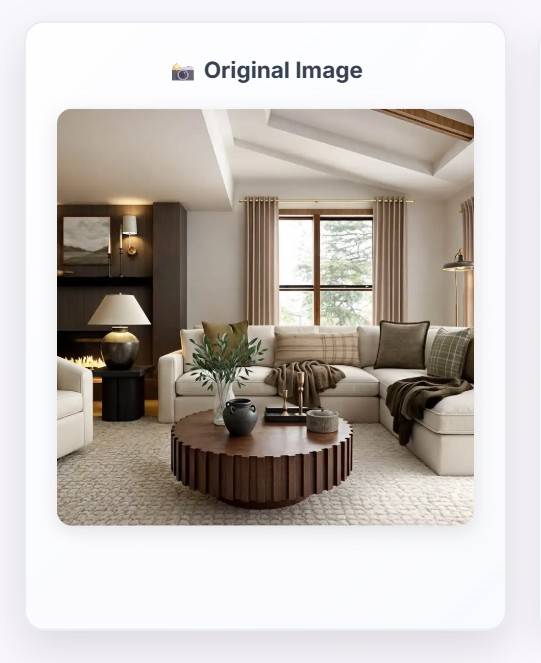
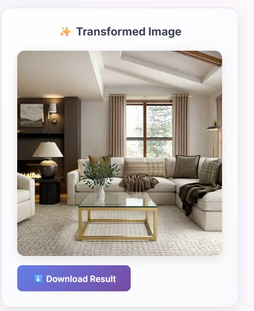

# 🎨 AI Image Transformer

A beautiful, modern web application that transforms images using cutting-edge AI technology. Upload any image and describe how you want it changed - from artistic styles to complete scene transformations.


## ✨ Features

- 🖼️ **Drag & Drop Upload**: Easy image upload with drag-and-drop functionality
- 🎨 **Multiple AI Models**: Choose from FLUX Pro, FLUX Dev, and Stable Diffusion models
- 🎯 **Smart Transformations**: Describe your vision in natural language
- 📱 **Responsive Design**: Works perfectly on desktop, tablet, and mobile
- 🎭 **Modern UI**: Beautiful glass-morphism design with smooth animations
- ⚡ **Real-time Processing**: Fast AI-powered image transformation
- 💾 **Download Results**: Save your transformed images instantly

## 📸 Demo Showcase

### Before & After Examples

| Original | Transformed | Description |
|----------|-------------|-------------|
|  |  | Watercolor painting style |
|  |  | Anime/cartoon conversion |
|  |  | Vintage photograph effect |

## 🛠️ Installation & Setup

### Prerequisites

- A modern web browser
- fal.ai API key (get one at [fal.ai/dashboard/keys](https://fal.ai/dashboard/keys))

### Quick Start

1. **Clone the repository**
   ```bash
   git clone https://github.com/yourusername/ai-image-transformer.git
   cd ai-image-transformer
   ```

2. **Add your API key**
   - Open `script.js`
   - Replace `'YOUR_FAL_AI_API_KEY_HERE'` with your actual fal.ai API key
   ```javascript
   const apiKey = 'your-actual-api-key-here';
   ```

3. **Open in browser**
   - Simply open `index.html` in your web browser
   - Or serve it using a local server:
   ```bash
   # Using Python
   python -m http.server 8000
   
   # Using Node.js
   npx serve .
   
   # Using PHP
   php -S localhost:8000
   ```

## 🎯 Usage

1. **Upload Image**: Drag and drop or click to upload an image (PNG, JPG, WebP)
2. **Describe Vision**: Enter how you want to transform your image
3. **Choose Model**: Select from available AI models
4. **Transform**: Click "Transform My Image" and wait for the magic
5. **Download**: Save your transformed image

### Example Prompts

- `"Make it look like a watercolor painting"`
- `"Convert to anime/cartoon style"`
- `"Add a beautiful sunset background"`
- `"Make it look like a vintage photograph"`
- `"Add magical sparkles and glowing effects"`
- `"Transform into a cyberpunk style"`

## 🏗️ Project Structure

```
ai-image-transformer/
├── index.html          # Main HTML file
├── styles.css          # CSS styles and animations
├── script.js           # JavaScript functionality
├── README.md           # This file
└── demo-images/        # Demo images (create this folder)
    ├── original1.jpg
    ├── transformed1.jpg
    ├── original2.jpg
    ├── transformed2.jpg
    └── ...
```

## 🎨 Customization

### Styling
- Modify `styles.css` to change colors, fonts, and layout
- Update the gradient colors in the CSS variables
- Adjust animations and transitions

### Functionality
- Add new AI models in the select dropdown
- Modify validation rules in `script.js`
- Add new file format support

## 🔧 API Integration

This project uses the [fal.ai API](https://fal.ai) for image transformation. The supported models include:

- **FLUX Pro Kontext**: Best for preserving original style
- **FLUX Dev**: High-quality transformations
- **FLUX Pro v1.1**: Highest quality results
- **Stable Diffusion v3**: Alternative model option

## 📱 Browser Support

- ✅ Chrome 80+
- ✅ Firefox 75+
- ✅ Safari 13+
- ✅ Edge 80+

## 🤝 Contributing

1. Fork the repository
2. Create a feature branch (`git checkout -b feature/amazing-feature`)
3. Commit your changes (`git commit -m 'Add amazing feature'`)
4. Push to the branch (`git push origin feature/amazing-feature`)
5. Open a Pull Request

## 📄 License

This project is licensed under the MIT License - see the [LICENSE](LICENSE) file for details.

## 🙏 Acknowledgments

- [fal.ai](https://fal.ai) for providing the AI image transformation API
- [Inter Font](https://fonts.google.com/specimen/Inter) for the beautiful typography
- All the amazing AI models that make this possible

## 📞 Support

If you have any questions or need help:

- 📧 Email: your-email@example.com
- 🐛 Issues: [GitHub Issues](https://github.com/yourusername/ai-image-transformer/issues)
- 💬 Discussions: [GitHub Discussions](https://github.com/yourusername/ai-image-transformer/discussions)

---

<div align="center">

**⭐ Star this repository if you found it helpful!**

Made with ❤️ and AI

</div>
